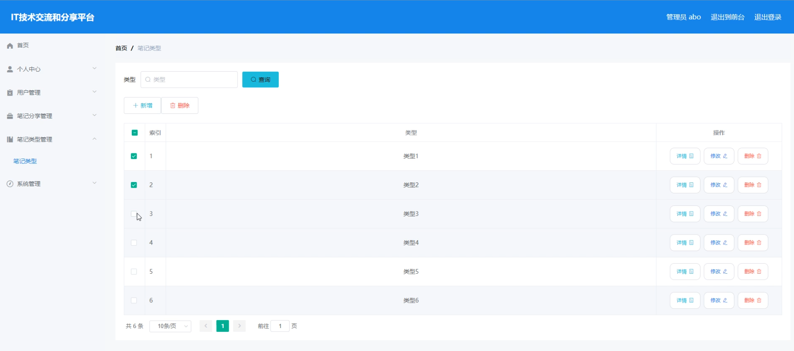

# 基于springboot的技术交流和分享平台

<h4 style='color:red'>联系不到我，就看我的主页 </h4> 
 
#### 介绍

在当今迅速发展的信息时代，技术交流和知识分享已成为推动创新和个人成长的重要途径。然而，许多现有平台在笔记管理和分类上存在不足，缺乏有效的知识组织和分享机制，导致信息获取效率低下，交流互动有限。为了解决这些问题，我开发了一款基于SpringBoot的技术交流和分享平台。该平台旨在为技术爱好者提供一个高效便捷的技术笔记分享和管理环境，通过多角色、多功能模块的设计，满足不同用户的需求，提升技术交流的效率和质量。系统通过管理员和用户两种角色的协作，确保内容质量和分类清晰，促进知识的传播和交流，为用户提供更好的使用体验。

#### 技术栈

后端技术栈：Springboot+Mysql+Maven

前端技术栈：Vue+Html+Css+Javascript+ElementUI

开发工具：Idea+Vscode+Navicate

#### 系统功能介绍

管理员角色功能模块

个人中心：管理员可以在个人中心查看和编辑个人信息，管理账户安全。  
用户管理：管理员可以管理平台上的用户信息，包括新增、修改和删除用户，确保用户数据的准确性和完整性。  
笔记分享管理：管理员可以管理用户分享的笔记内容，审核、发布或删除笔记，维护平台内容的质量。  
笔记类型管理：管理员可以管理笔记的分类，增加、修改或删除笔记类型，确保笔记分类清晰明了。  
系统管理：进行系统的整体管理和配置，确保平台稳定运行。  

用户角色功能模块

笔记分享：用户可以在平台上分享自己的技术笔记，发布技术文章，与其他用户交流技术知识。  
个人中心：用户可以在个人中心查看和编辑个人信息，管理账户安全，查看自己的分享和收藏记录。  
后台管理：  
笔记分享管理：用户可以管理自己分享的笔记内容，编辑或删除笔记。  
笔记类型管理：用户可以为自己的笔记选择或创建合适的分类，便于管理和搜索。  
我的收藏管理：用户可以管理自己收藏的笔记，方便随时查看和学习。  

#### 系统作用

对管理员的作用

内容管理：通过笔记分享管理和笔记类型管理，管理员可以有效控制平台内容的质量和分类，提升用户体验。  
用户管理：管理员可以通过用户管理模块，确保平台用户信息的准确性，维护良好的社区环境。  
系统稳定：系统管理功能帮助管理员维护平台的稳定运行，确保用户的良好使用体验。  

对用户的作用

知识分享：用户可以在平台上分享技术笔记，发布技术文章，与其他用户交流和分享知识。  
个人管理：个人中心帮助用户管理和更新个人信息，记录分享和收藏的笔记，方便自我管理和学习。  
资源分类：通过笔记类型管理，用户可以将笔记分类管理，便于查找和组织，提高学习效率。  

#### 系统功能截图

代码结构

数据库表

登录

用户管理

笔记分享管理

笔记类型管理

系统管理

用户端个人信息

新增笔记分享

前台页面

个人中心

#### 总结

基于SpringBoot的技术交流和分享平台，通过管理员和用户两种角色的设计，实现了对技术笔记的高效管理和分享。管理员可以通过系统进行全面的内容和用户管理，保障平台的质量和稳定性；用户则可以便捷地分享和管理自己的技术笔记，与其他用户进行技术交流，提升学习和交流的效率。该平台为技术爱好者提供了一个高效便捷的交流和分享环境，促进了技术知识的传播和交流。

#### 使用说明

创建数据库，执行数据库脚本 修改jdbc数据库连接参数 下载安装maven依赖jar 启动idea中的springboot项目

后台地址：http://localhost:8080/springboot1o52x/admin/dist/index.html

管理员  abo 密码 abo

前台地址：http://localhost:8080/springboot1o52x/front/index.html

